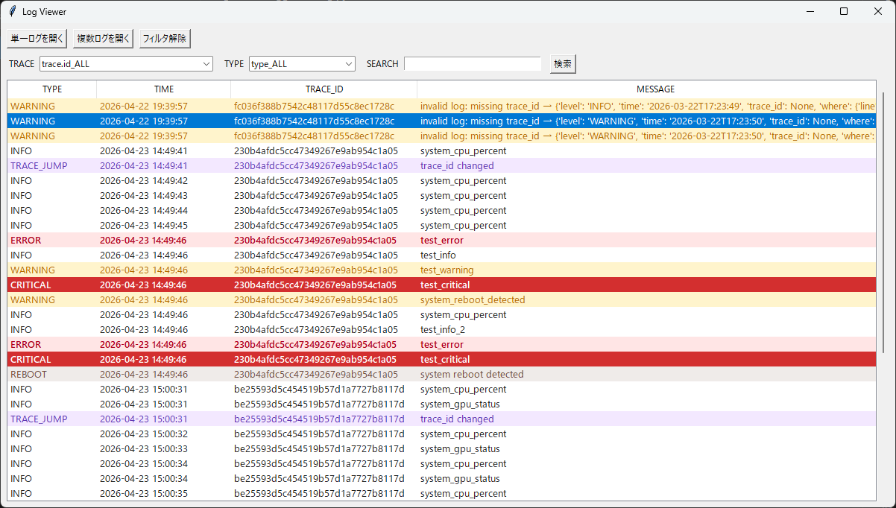
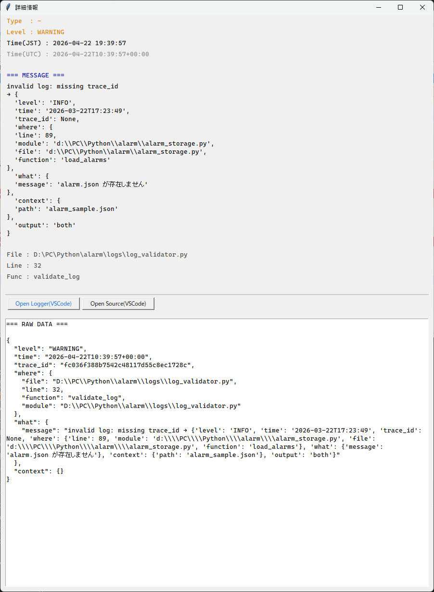

# Info Logger — Structured Logging + Event Analysis + GUI Viewer

🚀 A powerful logging system that turns logs into **debuggable events**



## 🔍 Detail View



Info Logger is a **structured logging + analysis + GUI viewer tool**
designed to make debugging faster, clearer, and more intuitive.

- For Japanese version → README_jp.md

---

## 🚀 What is this?

Most loggers only *record logs*.  
Info Logger goes further:

- ✅ Structured logging (JSON Lines)
- ✅ Built-in analysis (error / trace / reboot detection)
- ✅ GUI viewer for instant inspection

👉 Logs are not just outputs — they are **system events**.

---

## 💡 Why Info Logger?

### 🚀 What makes this different?

- Most loggers:
❌ Only record logs

- Info Logger:
⭕ Turns logs into debuggable events
⭕ Shows intent vs result
⭕ Detects hidden failures

---

## ✨ Features

- 🔍 **Trace-based tracking**
  - Track execution flow using `trace_id`

- 📍 **Automatic location detection**
  - File / line / function captured automatically

- 🧠 **Event analysis**
  - ERROR / CRITICAL detection
  - Trace jumps
  - System reboot detection

- 🖥️ **GUI Viewer**
  - View logs instantly
  - Filter by type / trace_id
  - Inspect raw JSON

- 🕒 **Timezone handling**
  - Internal: UTC
  - Display: Local time (JST)

---

## ⚡ Quick Start

### 1. Install (local)

```bash
git clone https://github.com/Flopbrane/log-analyzer.git
cd log-analyzer
```

---

### 2. Basic Usage

```python
from logs.log_app import get_logger

logger = get_logger()

logger.info("Application started")
logger.warning("Something unusual", context={"value": 42})
logger.error("Something failed", status="failed")
```

---

### 3. Run Viewer

```bash
python -m logs.log_viewer
```

👉 Logs will be displayed instantly in GUI

---

## 🧱 Architecture

```text
Application
    ↓
Logger (AppLogger)
    ↓
JSON Lines Log File
    ↓
log_searcher (analysis)
    ↓
Log Events
    ↓
log_viewer (GUI)
```

---

## 🧠 Design Philosophy

- Logs are events, not strings
- LogRecord is immutable
- trace_id represents a unique execution session
- Strict separation of responsibilities

| Layer    | Role    |
| -------- | ------- |
| Logger   | Record  |
| Searcher | Analyze |
| Viewer   | Display |

---

## 📂 Project Structure

logs/
├ multi_info_logger.py   # Core logger
├ log_storage.py         # I/O layer
├ log_searcher.py        # Analysis
├ log_viewer.py          # GUI
├ log_types.py
├ time_utils.py
└ env_paths.py

---

### 🇯🇵 Japanese Documentation

For Japanese users:

- Overview → README_JP.md
- Design → docs/Design.md
- Usage → docs/How_to_use.md

---

### 🚀 Future Plans

- Database backend
- Real-time monitoring
- Web dashboard

### 📄 License

- MIT License

### 💬 Concept

#### Why this Logger was created

This Logger was designed to eliminate **"silent failures"** that can occur during normal operation.

In many systems, issues do not always raise explicit errors.
As a result, problems may go unnoticed or become difficult to trace.

To address this, this Logger adopts a design that explicitly records **state and intent**.

In particular, it introduces a structured logging format:

```python
context: dict {variable / property : intended value}
```

This makes it possible to clearly understand:

- What the system was trying to do
- What values were expected
- Where deviations occurred

Additionally, the structure is designed to be easy to write, so developers can naturally include this information without friction.

---

This Logger is not just a logging tool.
It is a **design tool for ensuring state transparency and early detection of issues**.

This is not just a logger.

👉 It is a diagnostic system for understanding program behavior.

## Example: context usage

Below is an example of how the `context` field is used to make logs more informative.

### Code Example

```python
logger.info(
    "User login attempt",
    context={
        "user_id": user_id,
        "expected_status": "authenticated",
        "actual_status": auth_result,
    }
)
```

### Output Example

```json
{
  "type": "INFO",
  "time": "2026-04-18T10:15:30Z",
  "message": "User login attempt",
  "context": {
    "user_id": "A12345",
    "expected_status": "authenticated",
    "actual_status": "failed"
  }
}
```

### Why this matters

Instead of only seeing that something failed, you can immediately understand:

- What was expected
- What actually happened
- Which data caused the deviation

This makes debugging faster and prevents silent failures from going unnoticed.

---

If this project helps you,

**⭐ Please consider giving it a star!**
